## Challenge


## Writeup

The challenge, BadController comes with two files:

1. challdriver.exe - the aforementioned 'badcontroller' driver
2. log.pcap - a capture of the USB network traffic between the driver and the device

Opening up challdriver.exe in IDA decompiler, we see several functions and loops

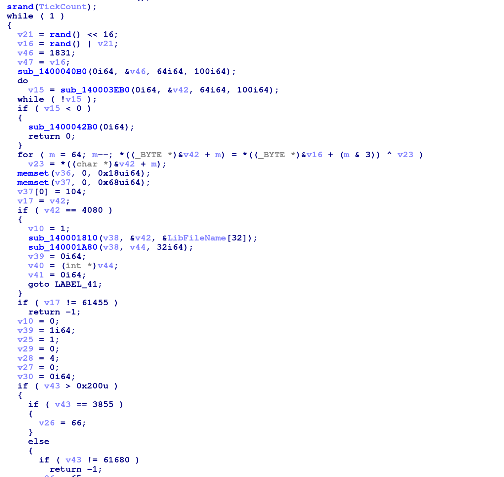

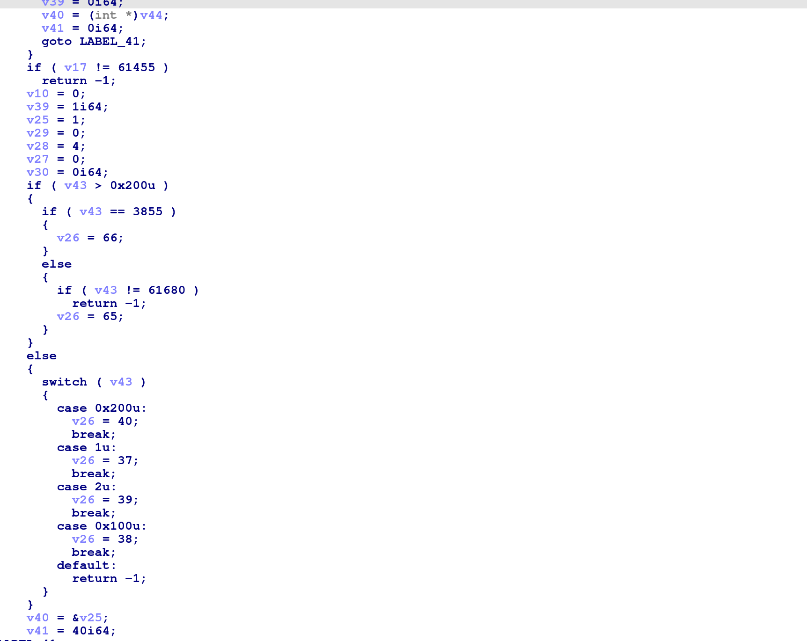


as well as this rather suspicious looking function call at the end

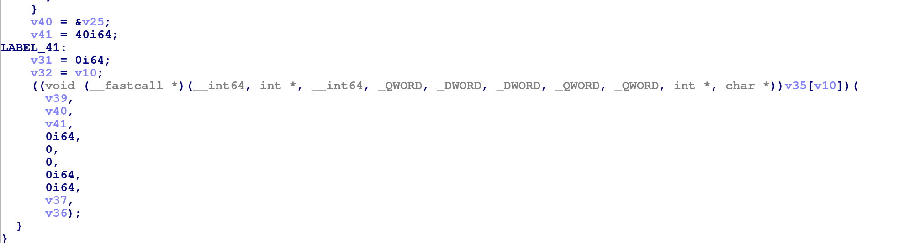


After some further static reversing:


- switch statement is probably the controller parsing logic

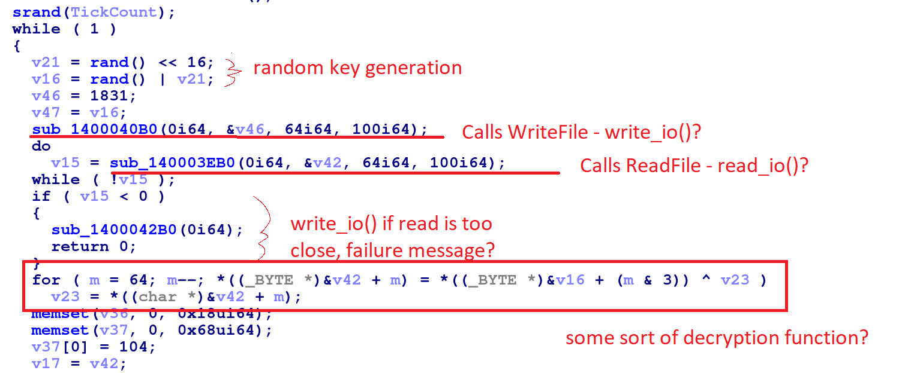
- (note that i didnt do all this reversing myself, credit to mzakocs and dnivra for doing a big part of this)

- sub_1400040B0  - calls WriteFile/IO functions with a Buffer
- sub_140003EB0  - calls ReadFile/IO functions with a Buffer
- tentatively labelled write_io and read_io respectively
- the rand() portion looks a lot like some sort of key/hash?
- tracing shows that its first sent out by write_io() then 
  xor'd with the buffer returned by read_io()

- assumption: this is code for parsing the USB data from the controller
- data is 'encrypted' with the key

- pause reversing, lets take a look at the pcap
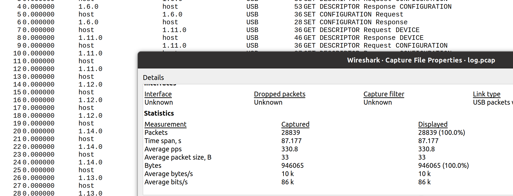
- ah f-

- first things first lets look up how 2 usb

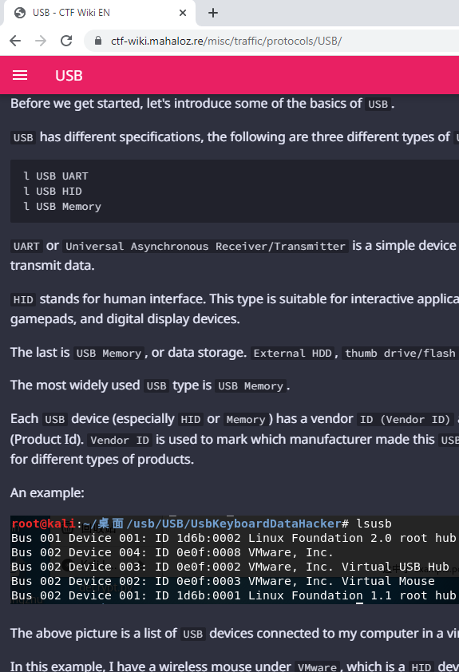

this mahaloz guy has a wiki
screenshots suggest he is chinese
honestly this just talks about keyboards so its useless
but the keyinsight i got was that you wanna look for interesting data dangling at the end of the packets

Anyway this is a controller, so its probably USB HID
There are multiple ips - 1.10.1, 1.62.0, 1.1.1
wtf are all these types
to the googles

Google each of the "USB INFO" types
Eventually zero in on the network traffic between host and 1.62.0
- honestly i don't fully recall how i decided this was the interesting traffic
- rough reasoning I recall:
	- its a weird address (1.1.1/1.2.1 seem like defaults)
	- if you sort by packet length, it has a lot of data
	- googling SET_REPORT Request suggests its used for sending info to a USB HID device
	- how is it talking back
	- SET_REPORT Response is empty what is this nonse-
	- wait wtf is URB_INTERRUPT in
	- oh hay every SET_REPORT Request is followed by several URB_INTERRUPT ins
	- the first URB_INTERRUPT in has stuff


So at this point i had like, a theoratical model of how things might be working
- driver makes a key
- sends key to device via SET_REPORT Request
- device encrypts traffic with key key and replies via URB_INTERRUPT
- driver reads the interrupt, decrypts the data and does switch case voodoo on it

There's an easy way to check this:
	- the driver sends the key in the clear
	- key is always preceeded by 0x727
	- 07:27 due to endian bullshit

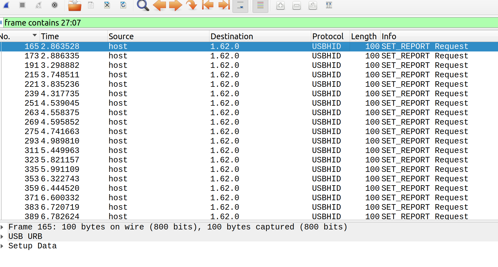

Awww yisssss

Alright wtf is the decryption doing
- proceed to spend way too much time getting confused by decompiled code
- pray to kylebot


- receive enlightenment
- its just a fucking in-place xor
- gdi

Okay lets check this with the first 'pair' of write/read
- key is 21:24:1b:6e
- first part of the URB_INTERRUPT leftover cap data is 2e:d4:1b:6f
- xor that shit
- 0f:f0:00:01

okay is that important?

mmmm

oh wait endianness

is there a 0xf00f an- ahar.

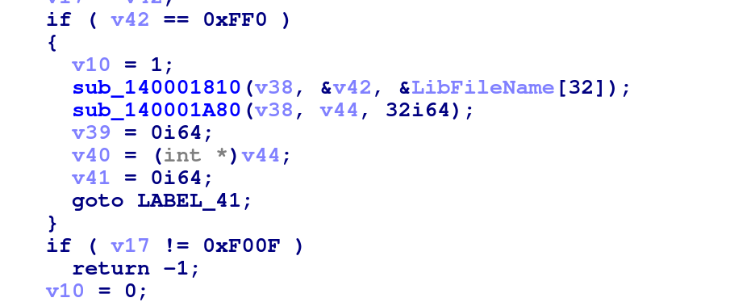

alright and is 0x0100 important?

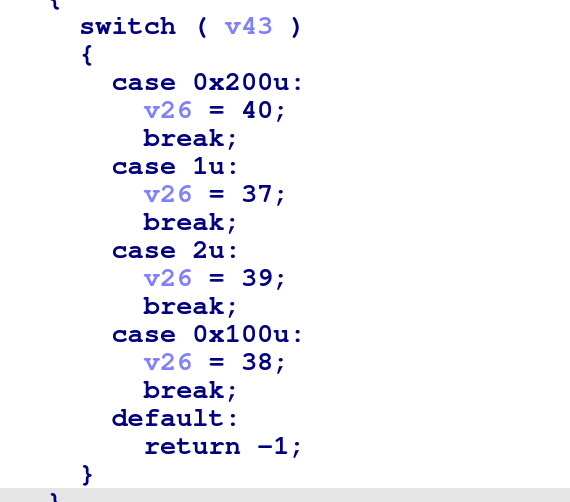

ahar.

okay so we're onto something. now i guess i just need to write a script for this.

*sigh*


- script is written in python3 with pyshark

okay run the script and we have all the cool traffic! wooooo~

now what.

uhh.

okay so if the first 2 bytes are 0xf00f it does what looks like controller logic
if the bytes are 0x0ff0 however it does that sus function (thanks to mzakocs for looking at this)

so i think the goal is to see what the sus function does by somehow replaying this pcap in

problem: we can't run the program
solution: cry

wait no apparently mzakocs and dnivra were looking into that

so it turns out you cant run the program because SetupDiEnumDeviceInterfaces thats called
at the start of the program fails and terminates
solution: patch it out!


now we can run it in x64dbg

except not really

okay set some breakpoints

okay so it tries to read shit and fails because theres nothing there
so lets manually insert our values


- breakpoint after read_io()
- set return value to 0x40 (since the payload is 64)
- breakpoint before the part where it checks for 0x0ff0
- look at where its checking, copy our buffer in
- breakpoint before the sus function
- it looks like the sus function is using values from the original read buffer

- replace original read buffer with our decrypted pcap payload
```
f00fd275ec75a33df5cf8023afb17d580da71bf9a5a2fbd4dbe625262756c72656e0148add731a611ed98dac9358c29e4d0d1d1b634209d724bcf901082576be
```
- run


- owo whats this

- so running it with the first traffic data does a shell command that echos a character 'm' to a file called conf
- ...
- ah shit really?
- how many packets for f0:0f (cause endianness) are there?
- to the script!1!!


so theres like...34 of these?
lets try with the next copy of traffic:
```
f00f9a45aec6ebf3dc1dc19d880ed6b7c55c946ce7b7587ce81f9845bde8d0e1336728ab4d191b2971f1ef7d604b1043b51fe27165fa6acbf9348601ba0e644c
```
- yup its an 'a'
- file now has 'ma'
- LEAP OF FAITH: so its probably 'maple{flag}' being created...?

next thing we tried (with dnvira) was to patch it so it could take input from the stdin
but we couldnt get it to run correctly with the debugger or without
so screw it, engage manual override

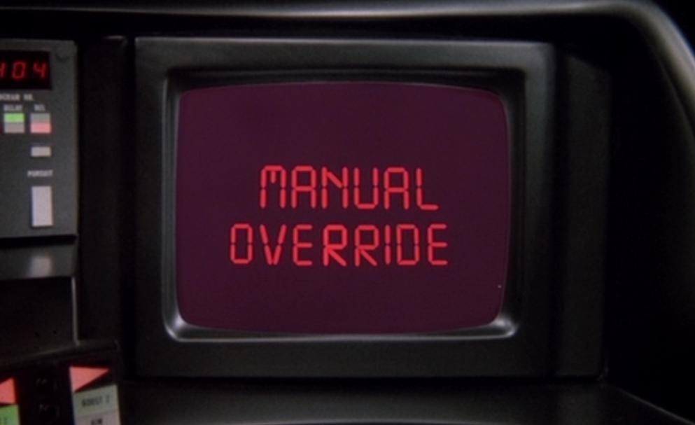

- patch the return value of read_io() to always return 0x40 
- patch out the rand() from key generation so it always generates 0x00000000
- breakpoint at the return point of read_io()
- using the earlier decryption script, generate the buffer values for all 34 packets
- override the buffer at that point with the corresponding payload
- run
- ???
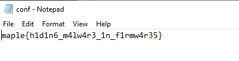
- :bread: we got the flag